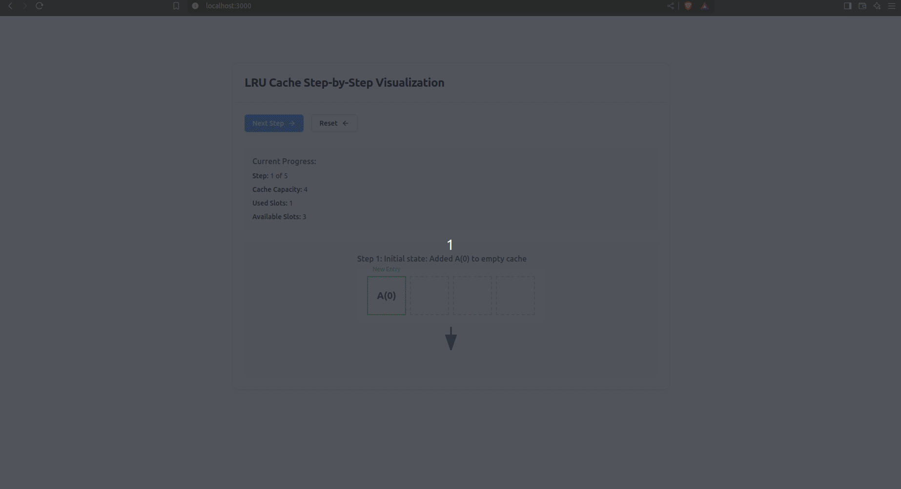

# LRU Visualization



## Clone the repository

```bash
git clone https://github.com/ToDucThanh/LRU-visualization.git
cd lru-visualization
```

## Install dependencies

```bash
npm install
```

## Start the development server

```bash
npm run dev
```

## Usage

Open the app in your browser at `http://localhost:3000`
